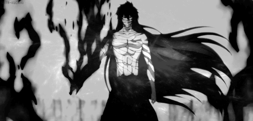
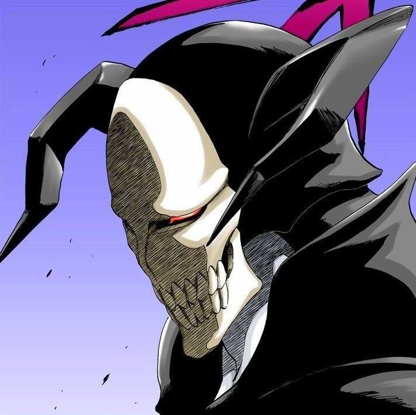
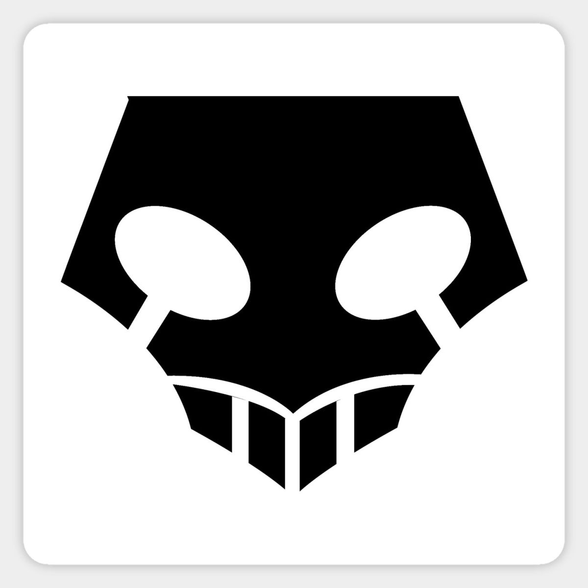
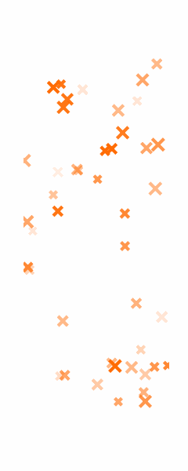
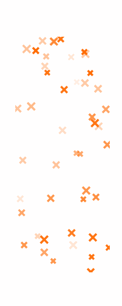

<!-- ==================== BLEACH THEME README — by Awizz (NeXuSS6N) ==================== -->

<!-- BANNER -->
<p align="center">
  <!-- Place ce fichier dans /assets/bleach-banner.gif -->
  
</p>

<!-- TYPING LINE -->
<p align="center">
  
</p>

<h1 align="center">🗡️ Awizz — Dev · Cyber Ops · Net</h1>

<!-- INLINE "REIATSU" DIVIDER -->
<p align="center">
  
</p>

<!-- PROFILE CARD -->
<div align="center">
  <table>
    <tr>
      <td valign="top" width="180" align="center">
        <!-- Optionnel : avatar stylé masque hollow -->
        
        <br/><br/>
        
      </td>
      <td valign="top">
        
```bash
> id: Awizz
> div: 11th Squad
> location: Soul Society
> status: Active | Training | Shipping
```

<p>
  <a href="https://github.com/NeXuSS6N?tab=repositories"></a>
  <a href="https://discord.com/users/0"></a>
  <a href="#"></a>
</p>

> Je dev des trucs.  
      </td>
    </tr>
  </table>
</div>

<!-- SECTION: STACK -->
<p align="center">
  
</p>

## ⚙️ Arsenal (Tech Stack)

```text
Web: HTML · CSS · JS      Back: PHP · MySQL · Node.js
Langs: Python · C         Game: Unity · Pygame
Ops: Linux · Docker · Networking · Cyber · Automation
```

<p align="center">
  
  
  
  
  
  
</p>

<!-- SECTION: FEATURED REPOS -->
<p align="center">
  
</p>

## 🗂️ Missions (Featured Repos)

> *Tous les projets sensibles sont pour **lab/éducation/pentest autorisé** uniquement.*

- **C2-Framework — RAT**  
  *Remote access & tasking pour lab; focus opérabilité et simplicité.*  
  🔗 `https://github.com/NeXuSS6N/C2-Framework---RAT`

- **LoL Orbwalker (Legacy)**  
  *Ancien outil d’orbwalk LoL à but d’étude.*  
  🔗 `https://github.com/NeXuSS6N/LoLOrbwalker`

<p align="center">
  
  <a href="https://github.com/NeXuSS6N?tab=repositories">
    
  </a>
  
</p>

<!-- SECTION: ACTIVITY -->
<p align="center">
  
</p>

## 📡 Spiritual Pressure (Stats)

<p align="center">
  
  
</p>

<p align="center">
  
</p>

<!-- SECTION: CONTACT -->
<p align="center">
  
</p>

## 🦋 Hell Butterfly (Contact)

```bash
discord: @awizzzoff
status: here
mail:   awizz.pro@proton.me
```

<p align="center">
  <a href="mailto:replace@youremail.tld"></a>
  <a href="https://github.com/NeXuSS6N?tab=followers"></a>
</p>

<!-- FOOTER -->
<p align="center">
  
</p>

<p align="center">
  
</p>

<!-- ===================== /END ===================== -->
